# TeamCity入门

## 简介

Powerful Continuous Integration out of the box

```
FREE FOREVER

Enterprise-level CI and CD at a $0 price tag
```

## 环境准备

- OS ElementaryOS
- openjdk-8-jdk
- github

## 下载地址

<https://www.jetbrains.com/teamcity/download/#section=section-get>


## 开始

1. 解压下载的压缩包到 /home/xxx/OpenSource

```shell
tar zxvf TeamCity-2020.1.1.tar.gz /home/xxx/OpenSource/

```

2. 进入解压好的目录

```shell
cd /home/xxx/OpenSource/TeamCity/bin
```

3. 启动

```shell
./runAll.sh start
```

4. 初始化

浏览器进入localhost:8111, 按照引导进行设置

5. 创建项目

创建界面如图所示

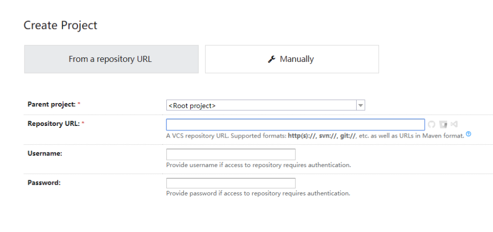

这里输入自己的项目git地址,teamcity会自动检测项目源代码,提供推荐的构建步骤

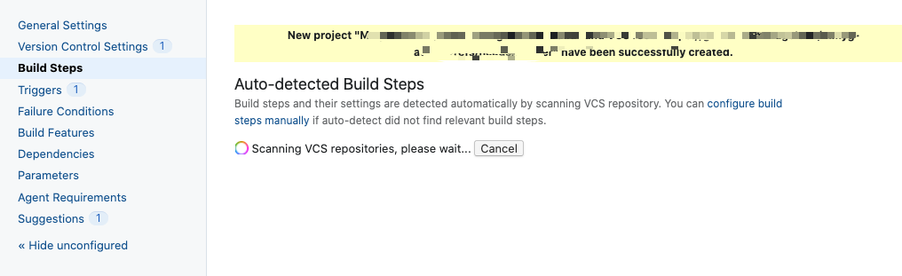

Java项目一般使用maven构建
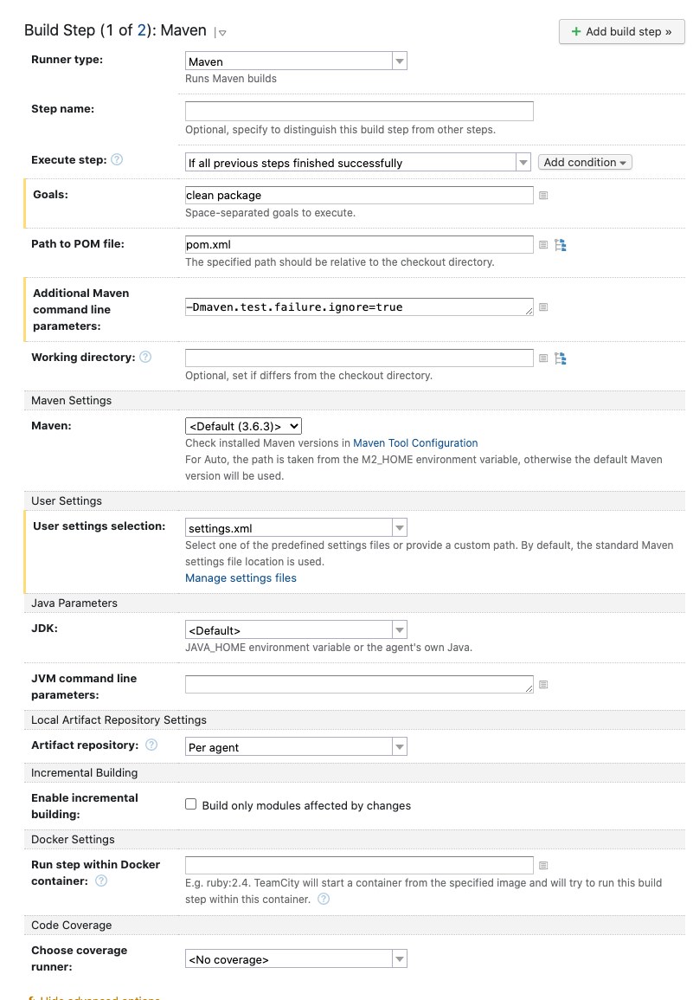

也可以自己定义构建步骤

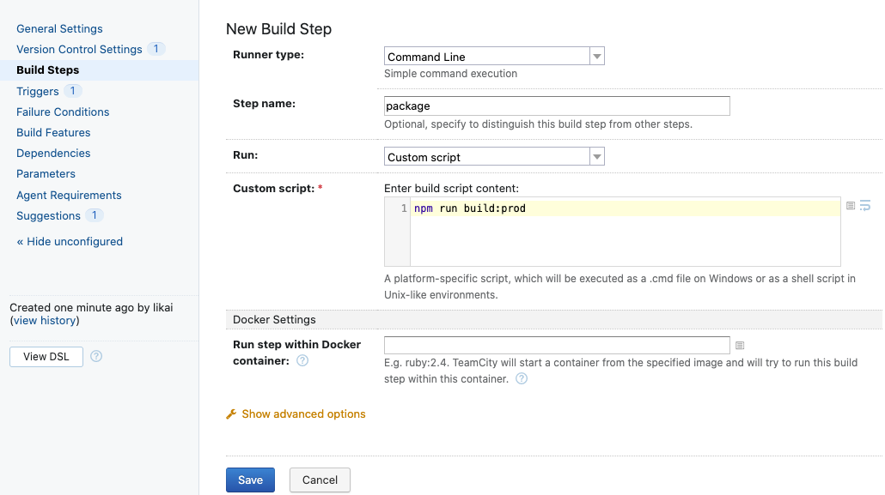

7. 使用maven镜像加速

国内一般使用阿里云maven加速,需要配置自定义的settings.xml文件

进入右上角的Administration菜单选择对应项目

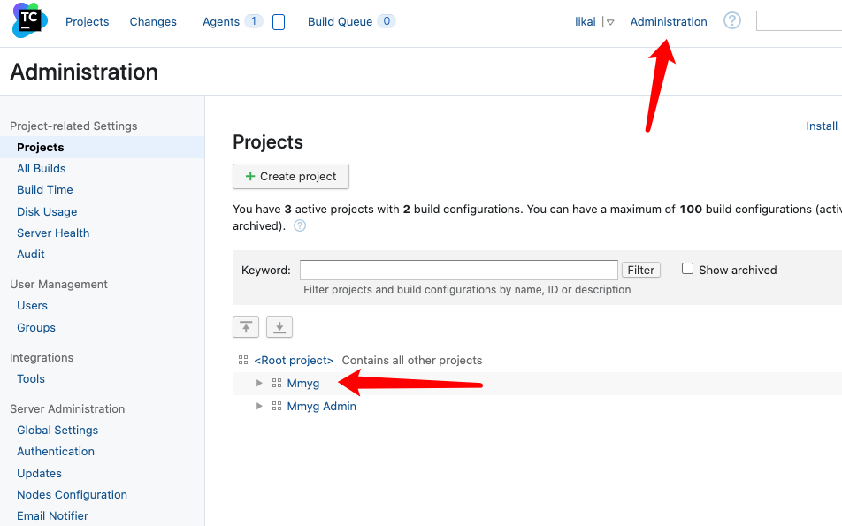

左侧选择Maven Settings, 然后右边上传自己的settings.xml

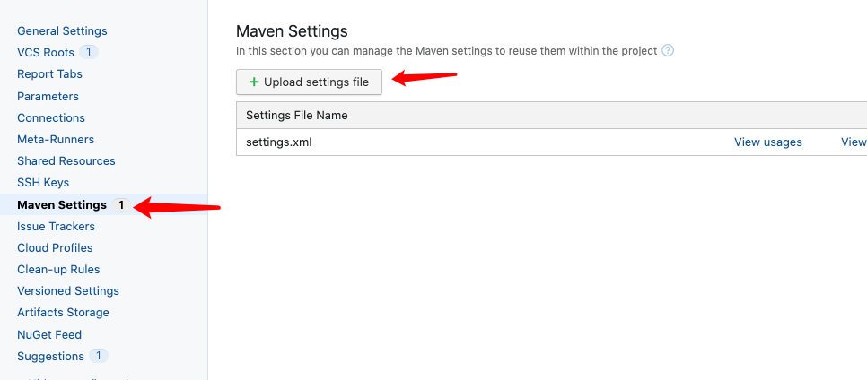

进入项目选择界面,进行build脚本修改

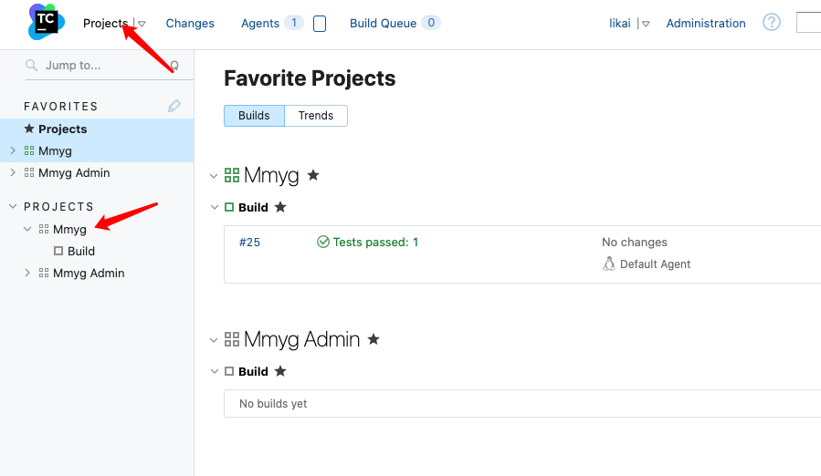

左侧选择Build 然后右边点击Edit configuration

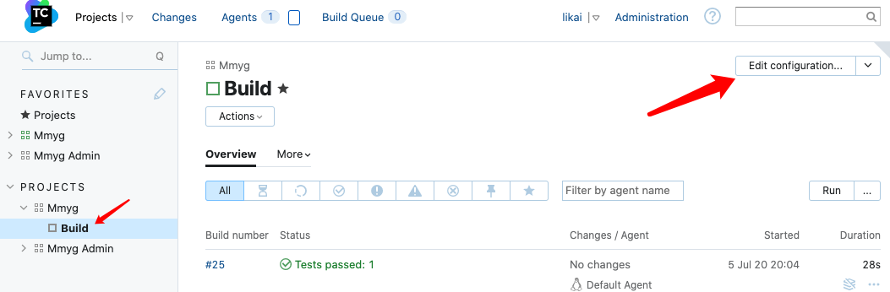

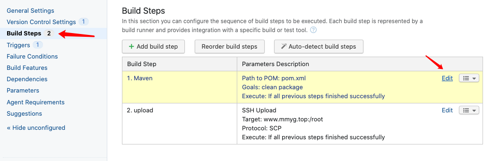

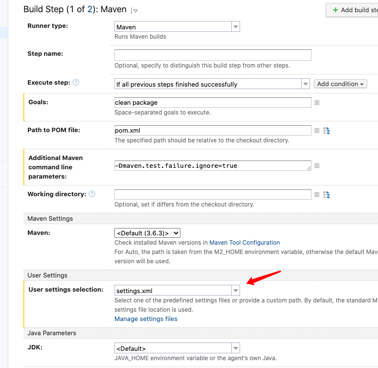

然后就可以回到项目界面运行build

## 部署项目到云服务器

1. 添加build step

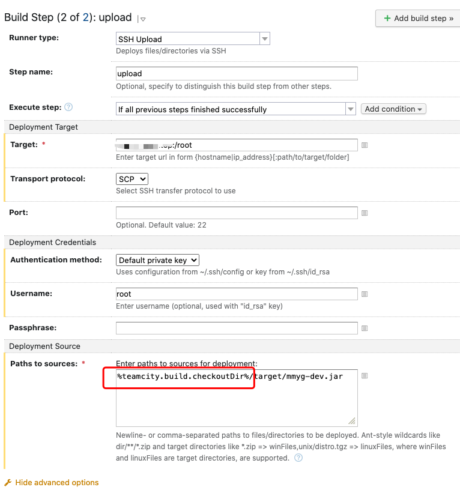

注意红框部分对应第一步build完的代码存放位置使用了环境变量

注意Target那一栏地址格式

2. 查看项目环境变量

如果不清楚具体环境变量含义,可以去查看官方文档 
[变量文档](https://www.jetbrains.com/help/teamcity/2020.1/build-checkout-directory.html)

也可以在build界面查看项目的环境变量值,进行对比

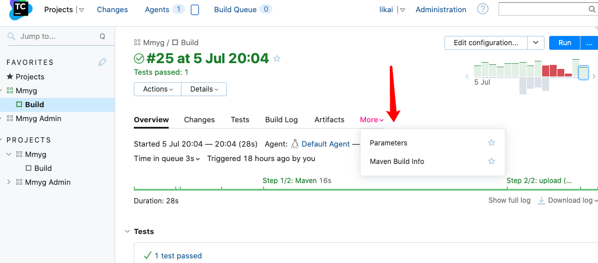